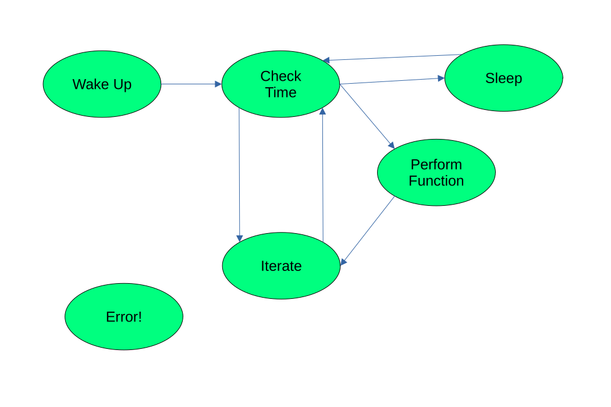

# rct_tower_scheduler
Sleep period scheduler for Radio Telemetry's tower deployments

## Problem
Given:
-	File `ensembles.json` containing functions to perform at scheduled times, specifications below, read:
  -	Function ensemble number n to perform now
  -	Time t<sub>n+1</sub> at which we need to perform next set of communications from `ensembles.json`

Constants:
-	Time t<sub>shutdown</sub> needed to go into sleep
-	Time t<sub>wake</sub> needed to wake from sleep

Need to find and communicate to sleep timer:
-	Time t<sub>sleep</sub> between going to sleep and being woken up

Perform ensemble n, then get current time t<sub>n</sub>.
Find t<sub>sleep</sub> as t<sub>n+1</sub> - t<sub>n</sub> – t<sub>shutdown</sub> – t<sub>wake</sub>, and communicate this to sleep timer.
Assume some `sleep(float sec)` function which tells the sleep timer to put given tower to sleep for sec seconds.
Remember to save variable indicating next ensemble to disk, since local memory will be wiped once tower goes to sleep.

## Input

### Initial File Format
Functions to perform should be stored in the following json format:
```
{
  "ensemble_list": [
    {
            "title": "print",
            "function": "path_to_module.module:function_name",
            "start_time": "hh:mm:ss",
            "iterations": 5,
            "interval": 60
        }
    ...etc...
  ]
}
```
With each item being of the correct type:
- function: period-delimited path to a callable function followed by function name, separated by a colon; function cannot take arguments
- starting time: colon-separated string containing hour, minute, and second at which to start:
  - hh two-digit hour in range [00, 23]
  - mm two-digit minute in range [00, 59]
  - ss two-digit second in range [00, 59]
- iterations: int
- interval (seconds between iterations): int

### Useable File Format
The initial file of ensembles is meant to be easy to write but is annoying to program around. We provide the `convertToActive.py` to convert the initial format into the `active_ensembles.json` file that the scheduler can use. You may also choose a name other than `active_ensembles.json` with the optional `fileout` argument.

It can be found in the `TowerScheduler` directory. Use it like this:
```
python convertToActive.py input_file.json --fileout optional_file.json
```

The script always outputs to `active_ensembles.json`. Be careful since it will overwrite a previous active ensembles file.

## Usage
Once you have a proper `active_ensembles.json` file, start the scheduler with:
```
python scheduler.py
```

If you want to use a file other than `active_ensembles.json`, you may specify this other file with the `--file` argument:
```
python scheduler.py --file path_to_file/ensemble_file.json
```

## Testing
- an example `ensembles.json` is provided
- convert desired ensemble schedule to active_ensembles.json as described above
- start the scheduler as above to run it

## Outline
1.	Fetch current ensemble (what should be performed) from disk
2.	Read current ensemble from file: function to perform and time to perform it
3.  Confirm it's time to execute this ensemble
4.	Let tower perform functions in current ensemble
5.	Perform calculations to find sleep duration given current time, time at which to perform next ensemble, and wakeup and shutdown times
6.	Save next ensemble to disk to indicate what comes next
7.	Send sleep command to sleep timer

## State Machine Diagram

